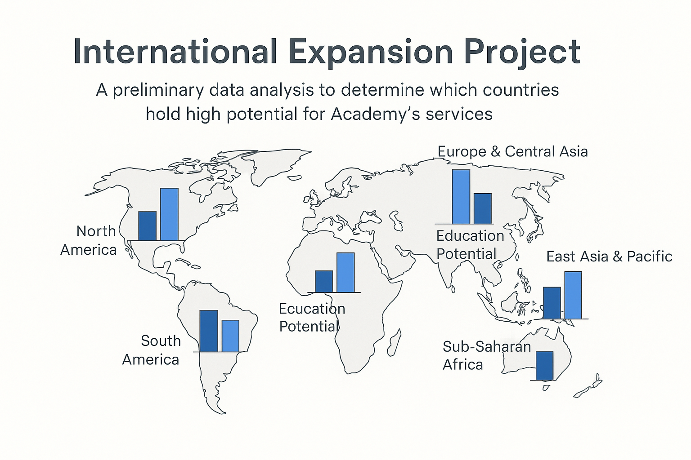

#  Academy Global Expansion – Data-Driven Insights

**Project Goal:**  
Support international expansion of Academy, an EdTech startup offering online learning content for high school and university students. Using World Bank education statistics, we aim to identify countries with strong growth potential and prioritize market entry.

##  Data Source

- **World Bank Education Statistics**
  - [Dataset Link](https://datacatalog.worldbank.org/dataset/education-statistics)
  - Contains over 4000 indicators related to access, attainment, teachers, and expenditure.

##  Project Objectives

1. **Evaluate Data Quality**  
   - Detect duplicates, missing values, and structural issues  
   - Summarize number of columns/rows and assess usefulness

2. **Select Relevant Indicators**  
   - Enrollment rates (secondary, tertiary)
   - Internet access for students/teachers
   - Education expenditure
   - Graduation rates

3. **Country Profiling & Comparison**  
   - Compute statistical summaries (mean, median, std)  
   - Group by regions or development levels

4. **Ranking & Recommendations**  
   - Identify top 10–15 countries with growth potential  
   - Visualize evolution over time  
   - Score and prioritize for action

## Key Visualizations

- Heatmaps for regional education access
- Line charts showing enrollment trends
- Comparative radar plots by region
- Missing data matrix

##  Preliminary Findings (example placeholder)

- High growth potential: India, Brazil, Nigeria, Indonesia
- Europe shows stable but saturated metrics
- MENA region has rising internet access + growing youth population

##  Tools Used

- Python (Pandas, Seaborn, Matplotlib)
- World Bank API
- Jupyter Notebooks

##  Next Steps

- Deeper investigation of top 5 countries
- Correlate education stats with digital penetration
- Validate with local market insights

